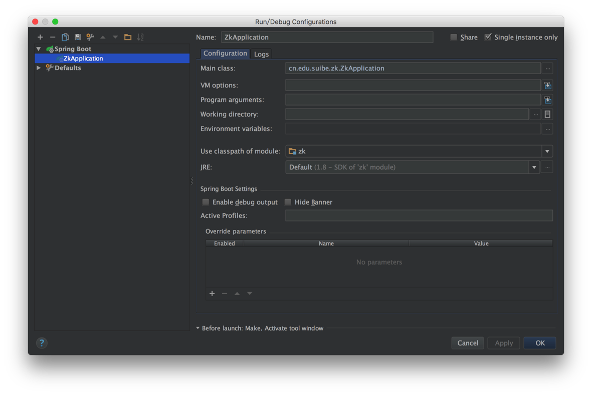

## 环境搭建

### 前置需求

1. JDK8.0
2. Intellij IDEA 14+

### 初始化

+ gradlew.bat idea  # 保证springboot可以被idea支持，其他时候如果发现某些依赖没有import，可以运行这个命令获取

+ gradlew.bat build # 构建项目

+ idea中设置gradle link project，配置框会在项目初次打开时自动提示的

### 启动服务

+ gradlew.bat bootrun

+ 或者 idea 中 run/debug configuration 配置 gradle 启动项目 (推荐，因为可以调试)

### 验证启动
+ 启动后，并不会弹页面，需要访问以下网址验证启动是否生效.
+ http://localhost:8080/admin

### 热更新

+ 在idea的project structure中设置编译的输出目录为build。项目启动后，通过make，即可实现有限的热更新。
+ 结合rebel的热更新。先在idea中安装jrebel，然后在idea中右键点击ZkApplication.java，在弹出菜单栏中选择 debug/run with jrebel，会自动生成一个启动配置,如下图:

    

## 第三方库

1. 模版引擎 Thymeleaf http://www.thymeleaf.org/
2. SpringBoot https://projects.spring.io/spring-boot/
3. Thymeleaf Layout Dialect https://github.com/ultraq/thymeleaf-layout-dialect

## 参考资料

1. Sprint MVC Reference https://docs.spring.io/spring/docs/current/spring-framework-reference/html/mvc.html
2. 如何使用springboot以jpa的方式访问数据库 http://blog.netgloo.com/2014/10/06/spring-boot-data-access-with-jpa-hibernate-and-mysql/
3. springboot的application.properties文件的常见配置 https://docs.spring.io/spring-boot/docs/current/reference/html/common-application-properties.html

## 数据库

1. 我家的数据库

    host: radxa.banshujiang.cn
    port: 3306(默认端口)
    username: zk
    password: 321123
    database: zk